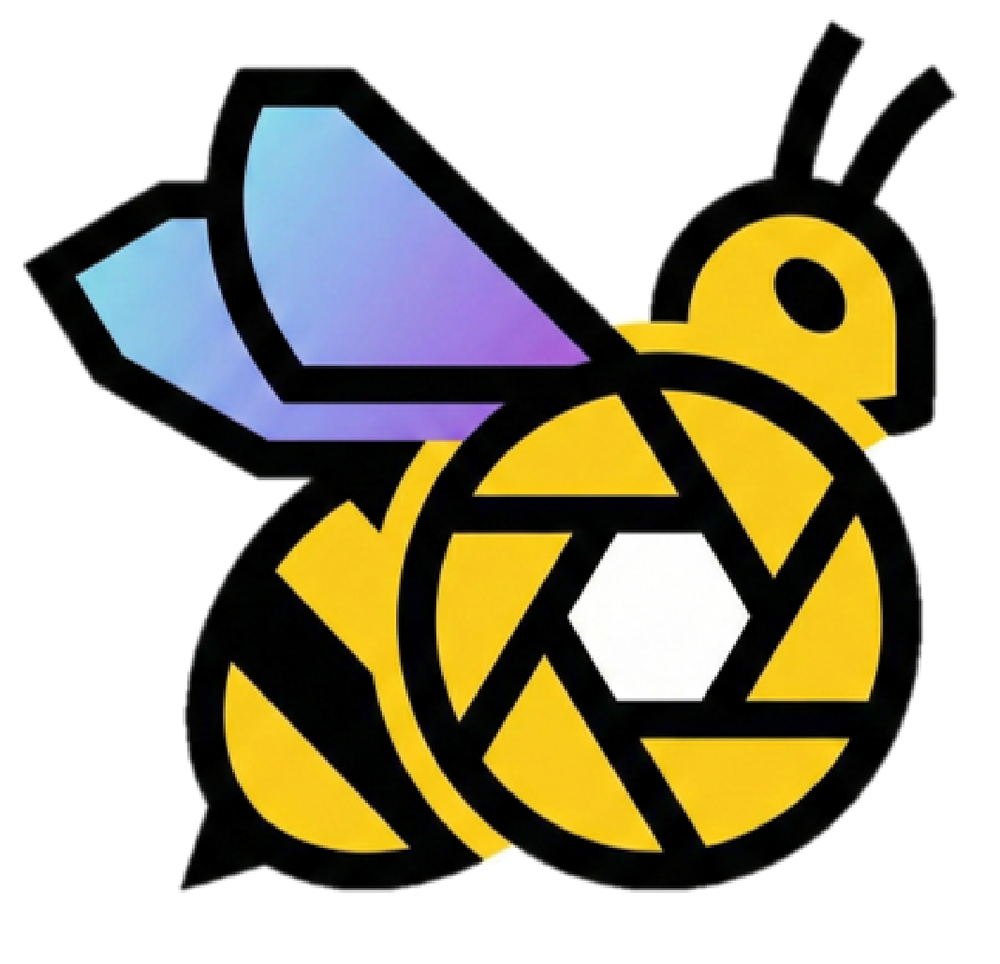

# APIS: Automated Polarization Imaging System

APIS (Latin for 'bee') is a control system for an automated 2-axis polarization imaging setup using Arduino, Python (PyQt6), and XIMEA cameras.

---



---

## 0. Quick Start
1) Install XIMEA drivers + xiAPI, and flash Arduino firmware
2) Build the hardware by following `docs/hardware_assembly_guide.md` and `docs/implementation_guide.md`
3) Review the calibration notes in `docs/implementation_guide.md`
4) Run `python app/main.py`
5) Connect Camera, Connect Controller, press RESET/ARM, then START SEQUENCE

---

## 1. What You Get

- GUI application (live view, manual motor control, and sequence automation)
- Safety logic (LATCHED/ARMED, ESTOP, RESET)
- Live RGB preview + RGB snapshot capture
- RAW16 sequence capture + CSV/JSON metadata logging
- RAW16 to RGB8 preview conversion tool
- Hardware check tool for quick diagnostics

---

## 2. Requirements

### Hardware
- Hardware assembly guide: `docs/hardware_assembly_guide.md`
  - Follow this guide for the printed parts, stage stack-up, bearings, and gear assembly.
- Hardware implementation guide: `docs/implementation_guide.md`
  - Follow this guide for the physical build, wiring, calibration, and verification steps.
- Controller: Arduino Uno (used in our lab setup; other compatible Arduino boards may also work)
- Polarizer motor (Axis 1): SG90 servo @ Pin 10
- Sample motor (Axis 2): HS-318 servo @ Pin 11
- Camera: XIMEA USB 3.0/3.1 camera
- Polarizer film: Edmund Optics `50 mm Dia. Linear Polarizing Film (XP42-18)`, PN `29490`
- Analyzer polarizer: mount a second linear polarizer in front of the camera lens for cross-polarization imaging
- Backlight: MORITEX MEBL-CW7050 with MLEK-A080W2LR (used in our lab setup)
  - Other backlight models can be used.
  - Mechanical/optical design should be adapted to the selected backlight specifications.
- Bearing balls: McMaster-Carr `9292K74`, hard wear-resistant 52100 alloy steel balls, `5.5 mm` diameter
- Fasteners: M3 screws for printed-part assembly and support-layer fastening
- Threaded inserts: Female-thread brass knurled threaded insert embedment nuts (heat-set inserts)
  - Inserts are embedded into the printed parts with a soldering iron before final mechanical assembly.
- External power adapter: UNIFIVE UN318-1215, 12V 1.5A
- Servo power regulator: LM2596/LM2596S DC-DC buck converter module
  - Example: JTAREA LM2596 adjustable module (4.0-40V to 1.25-37V, 2A, LED voltmeter)
  - Role in this implementation: `VIN/GND` from Arduino feeds the regulator input, and the regulator output powers the HS-318 servo.
- Printed STL parts:
  - `parts/support_1stfloor.stl`
  - `parts/support_2ndfloor.stl`
  - `parts/support_3rdfloor.stl`
  - `parts/support_4thfloor.stl`
  - `parts/polarizer_stage_gear.stl`
  - `parts/film_stage_gear.stl`
  - `parts/servo_gear.stl`
- Power wiring used in this implementation
  - `UNIFIVE UN318-1215 12V 1.5A` powers the Arduino.
  - `Arduino VIN/GND` is connected to the regulator `VIN/GND`.
  - `Arduino 5V/GND` powers the SG90 servo.
  - `Regulator VOUT/GND` powers the HS-318 servo.
  - Arduino and both servos share ground.
- Calibration
  - Both polarizer and sample stages use an image-derived calibration ratio in Python.
  - Current stage calibration is based on `data/calibrationsample/normal`.
  - Current calibrated stage-to-servo ratio is `1.059` for both axes.
  - With the current `0-180` servo command range, the calibrated software max angle is `169 deg` per stage.
  - Re-run calibration after reprinting parts, changing gear fit, or remounting servos.
  - For the cross-polarized crystallinity imaging workflow targeted by this build, the required operating states fall within a limited angular working envelope, so a compact servo-driven transmission was appropriate for the current system.
  - If a future version needs reliable motion well beyond this working envelope, upgrade the mechanical drive by changing the transmission ratio or moving to a stepper-based axis.

### Software
- Python 3.9+
- Arduino IDE (for flashing firmware)
- XIMEA Windows Software Package (drivers + xiAPI)

---

## 3. Installation (Development)

### 3.1 Create venv and install deps
```bash
python -m venv venv
venv\Scripts\activate
pip install -r requirements.txt
```

### 3.2 XIMEA Python API (xiAPI)
The XIMEA Python API is not on PyPI. Install the XIMEA Software Package first, then link the API into your venv.

1. Install the XIMEA Software Package (drivers + API)
2. Locate the API folder (default):
   - `C:\XIMEA\API\Python\v3`
3. Copy the `ximea` folder into:
   - `APIS\venv\Lib\site-packages\`

Verification:
```bash
python -c "import ximea; print('Success')"
```

---

## 4. Quick Start

### 4.1 Flash Firmware
Open `firmware/APIS_Firmware/APIS_Firmware.ino` and upload to your Arduino.

### 4.2 Run GUI
```bash
python app/main.py
```

If you are assembling the hardware from scratch, complete the mechanical assembly in `docs/hardware_assembly_guide.md` and the wiring/verification steps in `docs/implementation_guide.md` before running the GUI.

---

## 5. App Usage Guide

### Safety Bar (Top)
- Shows controller/camera state and current angles/exposure/gain
- ESTOP: immediately cuts motor torque (LATCHED)
- RESET / ARM: re-engages motors (ARMED)
- HOME: moves both motors to 0 degrees

### Device Connections
- Select COM port -> Connect Controller
- Connect Camera
- If XIMEA is not available, the app falls back to DummyCamera

### Manual Motor Control (Absolute Movement)
- Set absolute stage angle within the calibrated software range and click Move
- +45 buttons increment by 45 degrees

### Camera Settings
- Set exposure (us) and gain (dB)
- Click Apply Settings
- The live-view exposure default is `18000 us`
- For the current XIMEA acquisition baseline, auto white balance is disabled during capture.
- Camera gamma is fixed to `1.0` for both live view and sequence capture.
- Fixed white balance is currently `R=1.40`, `G=1.00`, `B=1.20` for both Normal and Crosspol acquisition.
- Re-check the fixed WB values if illumination, analyzer/polarizer alignment, or optics are changed.

### Live View and Snapshot
- Live view uses `XI_RGB24`
- Snapshot saves preview RGB TIFF to the selected folder
- Snapshot metadata is logged to `snapshot_log.csv`

### Sequence Control
- Set Save Directory and Sample ID
- Choose modes: Crosspol / Normal
- Set exposures (defaults: Crosspol `50000 us`, Normal `18000 us`)
- Set angles (list or range, within the calibrated software range)
  - List: `90,60,45,30,0`
  - Range: `0:169:15`
- Settling Time: motor settle delay after each move
- Sequence capture uses `XI_RAW16` only
- During sequence capture, live view is paused and restored after completion
- Sequence images are saved as Bayer RAW `uint16 TIFF` without demosaicing or gamma

### Polarizer Angles (Sequence)
- Crosspol: polarizer moves to 90 degrees
- Normal: polarizer moves to 0 degrees

### Image Conversion
- Convert saved RAW16 TIFFs into confirmation-only `RGB8` previews
- Input scope: the selected folder and its immediate child folders
- Output folder: `<selected_folder>_rgb`
- Conversion pipeline: demosaic (`GBRG`) -> fixed white balance -> gamma `1/2.2`
- Original RAW16 files are preserved

---

## 6. Outputs

- Images:
  - `{SaveDir}/{SampleID}/crosspol`
  - `{SaveDir}/{SampleID}/normal`
- Log file:
  - `{SaveDir}/{SampleID}/{SampleID}_log.csv`
- Sequence metadata:
  - `{SaveDir}/{SampleID}/{SampleID}_metadata.json`
- Snapshot log:
  - `{SaveDir}/snapshot_log.csv`
- Optional RGB preview conversion:
  - `{SelectedFolder}_rgb/`
  - Example: `{SaveDir}/{SampleID}_rgb/crosspol/*_rgb.tif`

---

## 7. Safety Logic

- LATCHED: default on boot or ESTOP, motors detached
- ARMED: motors attached, motion enabled
- Commands are rejected in LATCHED state

---

## 8. Verification

- Automated tests: `tests/test_mock_serial.py`
- Manual hardware check: `scripts/check_hardware.py`
- Raw servo endpoint test (within firmware-supported `0-180` servo range): `scripts/test_servo_limits.py`
- Distribution includes `check_hardware` for quick COM port and ESTOP validation

---

## 9. Build and Distribution (Windows)

Recommended flow:
1) PyInstaller onedir build
2) Zip the dist folder for distribution
3) (Later) Inno Setup for installer packaging

### Build prerequisites
- Use a clean build venv with PyQt6 only (do not install PySide6/PyQt5)
- Icon file: `assets/icon.ico` (already provided)

### Build (spec-based)
- Spec files: `build/apis.spec`, `build/check_hardware.spec`
- Build script: `build/build.ps1`

Example:
```powershell
.\build\build.ps1 -Version 0.1.2
```

### Distribution package
The build script produces:
- `dist/APIS/` (GUI app)
- `dist/check_hardware/` (console tool)
- `release/APIS-win64-vX.Y.Z.zip` containing:
  - `APIS/`
  - `check_hardware/`
  - `README.txt`
  - `prereq_checklist.md`

### XIMEA prerequisite
XIMEA drivers/xiAPI must be installed first. The EXE does not bundle the SDK.

---

## 10. Repository Notes

- `data/`, `dist/`, and `release/*.zip` are ignored by git
- `.vscode/` and `build_venv/` are ignored by git
